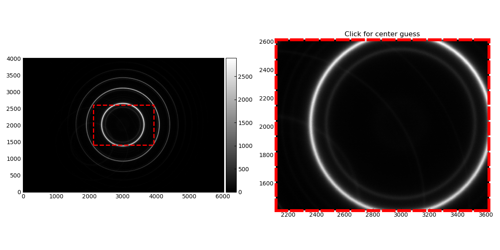
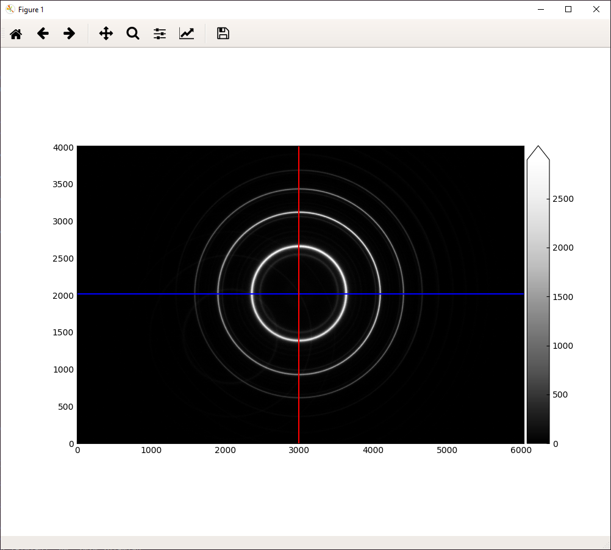
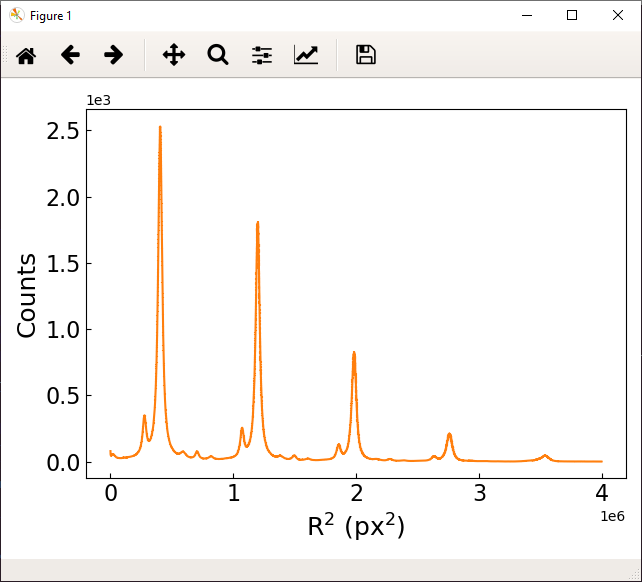

=============
Fabry
=============

Package for analyzing Fabry-Perot interference patterns

Usage
===============

* Read in a Fabry-Perot image, locate the center of the ring pattern, and ring sum
.. code-block:: python

    from fabry.core import ringsum
    from fabry.tools import images, plotting

    filename = "<image_name>"
    image_data = images.get_data(filename, color='b')  # r g b or None
    xguess, yguess = plotting.center_plot(image_data)  # Prompt the user to click an initial guess for the center of the ring pattern
    x0, y0 = ringsum.locate_center(image_data, xguess=xguess, yguess=yguess, binsize=0.1)  # Find the center from initial guess
    r, signal, signal_uncertainty = ringsum.ringsum(image_data, x0, y0, binsize=0.1)

This is accomplished by the process_image.py script located in python_FabryPerot/bin. If the user not does provide --no_click flag, the user will be prompted to click an initial guess on the ring pattern as seen in the screenshot below.

After the user provides a guess of the center of the rings, the locate_center function will iteratively search for the center. An example of a found center is shown below.

After the center is found, a 'ringsum' is calculated where the image is split into annuli of equal area where means and standard deviations are calculated. An example figure plotted in pixel squared space is shown below.

Installation
=================

Prerequisites
-----------------

Install the requirements listed in the requirements.txt file. I recommend using anaconda to do so to pick up on any not listed dependencies. However, PyMultiNest and RawPy require external non python libraries to be installed first.

* Anaconda has its own version of mpich that mpi4py is built with. I highly recommend that you uninstall mpi4py and install your own version of mpich or open-mpi. Afterwards, you will want to load them using module load mpich (or open-mpi). Then you can install mpi4py using pip. If you want to use MPI with PyMultiNest, it is critical you run module load before installation of MultiNest.

* PyMultiNest can be installed via pip or via the github repository.

.. code-block:: 
    
    git clone https://github.com/JohannesBuchner/PyMultiNest/
    cd PyMultiNest
    python setup.py install

Use the "--user" switch if you want to install locally.

* PyMultiNest requires MultiNest to run. The simple instructions for building and installing are

.. code-block:: 
    
    git clone https://github.com/JohannesBuchner/MultiNest
    cd MultiNest/build
    cmake ..
    make

More detailed instructions are located `here <http://johannesbuchner.github.io/pymultinest-tutorial/install.html#on-your-own-computer>`_. You will need to set the LD_LIBRARY_PATH environment variable to point to the install location of libmultinest.so.

* Rawpy requires libraw. If you looking for a specific version, it can be installed from the source repository.
    
.. code-block::
    
    git clone https://github.com/LibRaw/LibRaw.git libraw
    git clone https://github.com/LibRaw/LibRaw-cmake.git libraw-cmake
    cd libraw
    git checkout 0.19.0
    cp -R ../libraw-cmake/* .
    cmake .
    sudo make install

Afterwards rawpy can be installed using ``pip install rawpy --no-binary rawpy``. 

Install Fabry Package
------------------------

* After the requirements have been satisfied, I recommend installing fabry as a developer because it is under active development still. This can be done by using

.. code-block::
    
    cd python_FabryPerot/
    python setup.py develop

This will create a symlink for the fabry modules. Any change made will take immediate effect.

